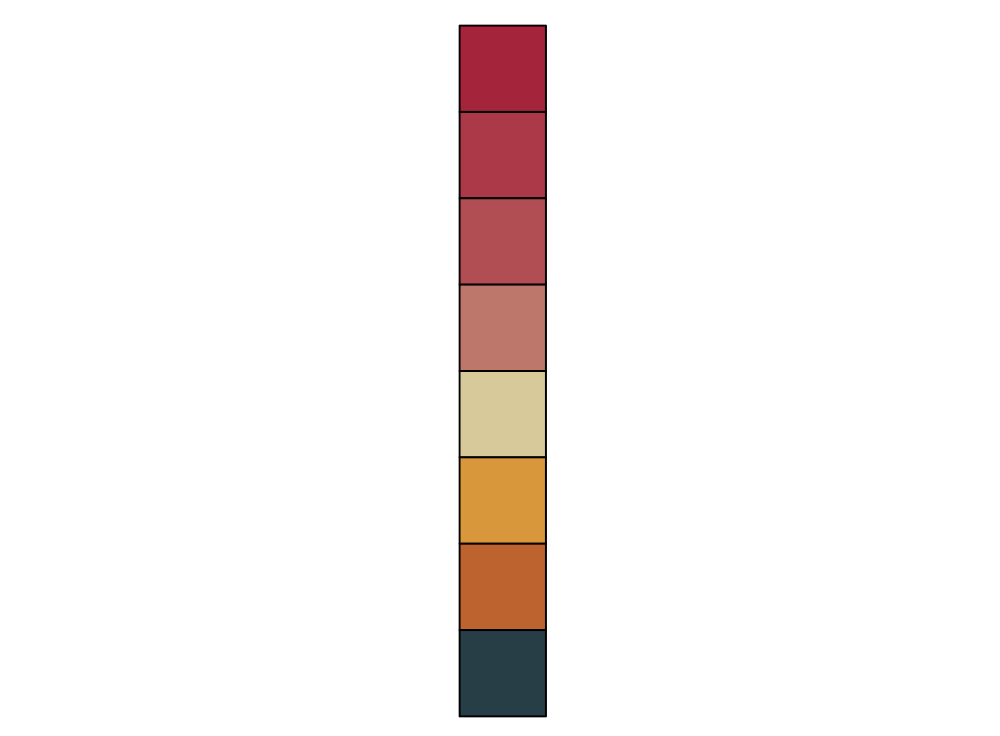
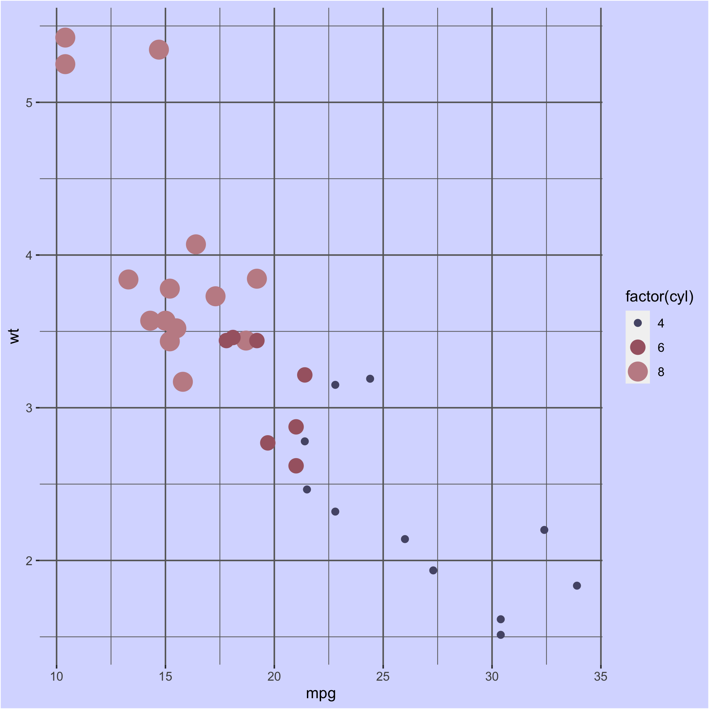

# cooloRsampler
cooloRsampler is an R package for generating color palettes from [Coolors](https://coolors.co/). This package streamlines grabbing color palette HEX codes to use for your next data visualization, offering an automated way to quickly try out countless palettes.

### Installation

You can install the current verion of cooloRsampler from
[GitHub](https://github.com/kkakey/cooloRsampler) with:

``` r
# install.packages("devtools")
devtools::install_github("kkakey/cooloRsampler")
library(cooloRsampler)
```
#### The current version of cooloRsampler requires Firefox. **Please install Firefox from [here](https://www.mozilla.org/en-US/firefox/new/)**, if you do not have the application already. 

*************************************************

### coolor_sampler()

This function grabs a randomly generated color palette of 2 to 9 colors from https://coolors.co/.

| parameter | description |
| ------------- | ------------- |
|**ncolor** | Number of desired colors in palette. Default is 5. |
|**type** | Type of palette: continuous or discrete. Default is discrete. |

```r
# Generates a color palette of 8 from https://coolors.co/
my_colors <- coolor_sampler(ncolor=8)
[1] "Grabbing some colors - this will take just a few seconds!"

my_colors
[1] "#08415C" "#213E58" "#393B53" "#6A3549" "#CC2936" "#EBBAB9"
[7] "#388697" "#B5FFE1"

# Check out the colors
scales::show_col(my_colors, label=F, ncol=1)
# Unsatisfied? Run `coolor_sampler()` again!
```


Not entirely satisfied with the palette generated? Run `coolor_sampler()` again!
*************************************************

### Example

```r
library(cooloRsampler)

my_colors <- coolor_sampler(ncolor=5)
[1] "Grabbing some colors - this will take just a few seconds!"
```

```r
# Easily add the palette to your next ggplot!
background_col <- my_colors[1]
points_col <- my_colors[2:length(my_colors)]
```

```r
library(ggplot2)
data("mtcars")

ggplot(mtcars, aes(mpg, wt)) +
   geom_point(aes(colour = factor(cyl), size = factor(cyl))) +
   scale_colour_manual(values = rev(points_col)) +
   theme(plot.background = element_rect(background_col),
         panel.background = element_rect(background_col),
         legend.background = element_rect(background_col),
         panel.grid.major = element_line("grey40"),
         panel.grid.minor = element_line("grey40"))
```


Not satisfied with the palette choosen, run **coolor_sampler()** again! This funcation is an easy way to directly try out new discrete or continuous color palettes.

